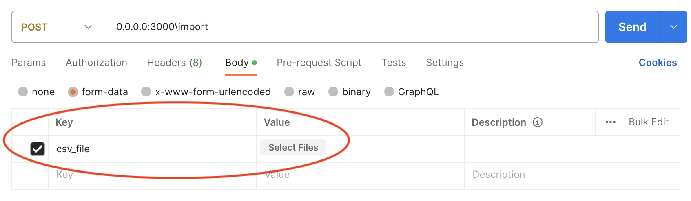

# UrbanTide Task

This application imports CSV files based on the outliers in the file data. If the outliers are present then the file is discarded.

The backend is developed in NodeJS and Postgres database is used.
## Getting Started

### Requirements
- NodeJS 14
- Postgres 14
- Postman (or any other platform for using apis)

### Setting up
1. Clone this repository in the terminal.
``````
git clone https://github.com/syedsaifhasan/signol-coding-challenge.git
``````
2. Run the Postgres database container.
``````
docker-compose up
``````
3. Install NodeJS libraries
``````
npm install
``````
4. Run the api service in another terminal.
``````
npm run start
``````

### Testing

Some CSV files are provided in this repository for testing this application.

The following are the test cases for each file:
- **testOne.csv**: PASS
- **testTwo.csv**: FAIL

In order to test this application, use any API platform, like Postman, to send CSV file on the following endpoint
``````
0.0.0.0:3000\import
``````

The CSV file should be attached against "csv_file" key as shown in the screenshot below



## Author's notes:

### Note 1
The application doesn't work as a containerized application at this moment due to some database connection issues but this works on my local machine perfectly uncontainerized. However, I have still provided the Docker ile and a few instructions on  how to start this application if the database issue was working.

**Step 1**: Build Docker image
````
docker build . -t app   
````
**Step 2**: Run Docker image
````
docker run -p 5432:5432 -d app
````
**Step 3 (optional testing)**: Follow the instructions in the testing section

### Note 2
I have also built this application in Python 3 where the CSV files are handled using Pandas instead of API calls. I have provided the Python script in this respository and few instructions on how to run it below:

**Prerequisites**: Python 3, pip3

**Step 1**: Install Python packages
````
pip3 install psycopg2 pandas  
````
**Step 2**: Run Python script
````
python3 main.py
````

The testing of the CSV files has been integrated in the script so the testing of the application is done automatically there.

The logging in the scripts will indicate that the difference in database entries before and after testing the CSV files. The application is only expected to make entries from the file CSV file.
